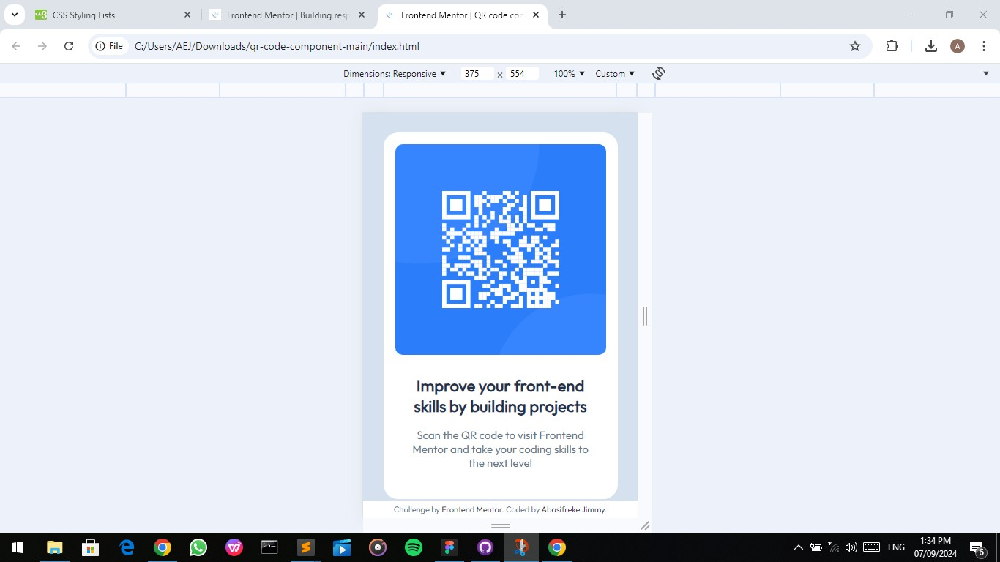
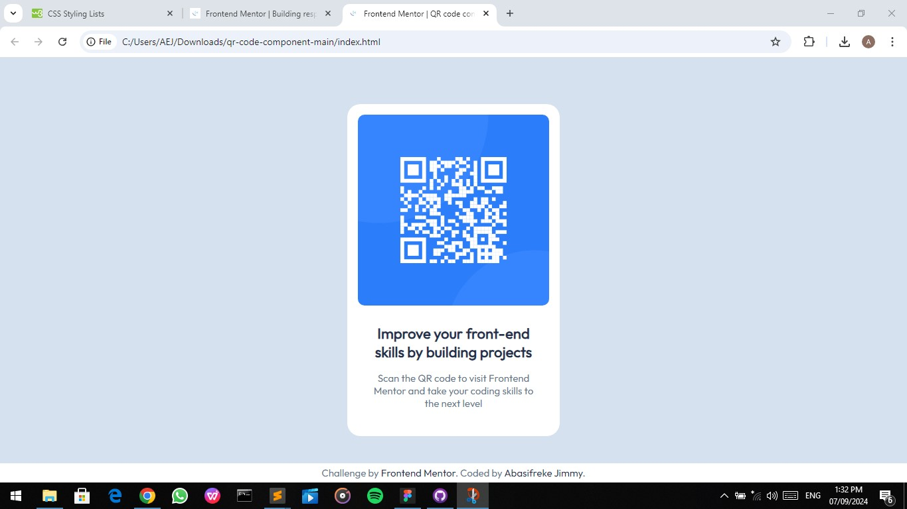

# Frontend Mentor - QR code component solution

Please, this is my approach to the [QR code component challenge on Frontend Mentor](https://www.frontendmentor.io/challenges/qr-code-component-iux_sIO_H).

## Table of contents

- [Overview](#overview)
  - [Screenshot](#screenshot)
  - [Links](#links)
- [My process](#my-process)
  - [Built with](#built-with)
  - [What I learned](#what-i-learned)
  - [Continued development](#continued-development)
  - [Useful resources](#useful-resources)
- [Author](#author)
- [Acknowledgments](#acknowledgments)

## Overview

### Screenshot




### Links

- Solution URL: (https://github.com/Abas-code/qr-code-component-main)
- Live Site URL: (https://qr-code-component-main-ruby.vercel.app/)


## My process

### Built with

- Semantic HTML5 markup
- CSS custom properties
- Mobile-first workflow

### What I learned

I learnt how to make variables for different CSS styling through this project.

```css
:root { --colorOne: #ffffff; --colorTwo: #d6e2f0; --colorThree: #68778d; --colorFour: #1f3251; }

body { overflow: hidden; background: var(--colorTwo); font-family: 'Outfit'; }
```

### Continued development

I would like to focus on newer and simpler ways of structuring and styling web pages in future projects. I will also take up a Javascript course.

### Useful resources

- [W3Schools](https://www.w3schools.com)


## Author

- Frontend Mentor - [@Abas-code](https://www.frontendmentor.io/profile/Abascode)


## Acknowledgments

I really want to thank the makers of w3schools. The website has been a tremendous help.